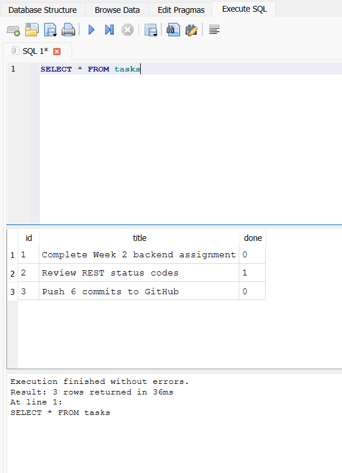

# FastAPI To-Do CRUD API (SQLite Persistence)

A production-ready, performant REST API built using **Python**, **FastAPI**, **Uvicorn**, and **SQLite database persistence**.

🔗 **GitHub Repository**: [https://github.com/HarshalMhaske2023/W2.A1-Building-CRUD-APIs](https://github.com/HarshalMhaske2023/W2.A1-Building-CRUD-APIs)

---

## Project Overview

This project implements a complete CRUD (Create, Read, Update, Delete) REST API for managing tasks. It utilizes Pydantic for schema validation, FastAPI for route definition and interactive OpenAPI documentation, Uvicorn as the ASGI server, and an SQLite database for persistent storage.

### Why SQLite Was Chosen
- **Single-File Storage**: Entire database lives in a lightweight single file (`tasks.db`), eliminating the need for complex external database servers (like PostgreSQL or MySQL) for local development.
- **Zero Setup & Zero Configuration**: Requires no installation or background daemon service; Python includes native support via the built-in `sqlite3` module.
- **Data Persistence (Survives Restarts)**: Unlike in-memory data structures, SQLite writes all table state to disk, so tasks persist seamlessly across application restarts.

---

## Database Architecture & Behavior

- **Database File**: [`tasks.db`](file:///c:/Users/HP/OneDrive/Desktop/FlyRank%20Tasks/CRUD%20APIs/tasks.db) located in the project root directory.
- **Automatic Lifecycle**: Initialized automatically on startup via FastAPI `lifespan` handler (`init_db()`). If `tasks.db` does not exist or the `tasks` table is empty, it automatically creates the table schema and seeds the 3 initial tasks.
- **Version Control Safety**: `tasks.db` is explicitly listed in `.gitignore` to prevent local binary database files from being committed to source control.

---

## Run Instructions

1. Install dependencies:
   ```bash
   pip install -r requirements.txt
   ```

2. Start the FastAPI development server:
   ```bash
   uvicorn main:app --reload
   ```

3. Access the interactive API documentation:
   - **Swagger UI**: [http://localhost:8000/docs](http://localhost:8000/docs)
   - **ReDoc**: [http://localhost:8000/redoc](http://localhost:8000/redoc)

---

## Core CRUD Endpoints

| Method | Path | Description | Success Status |
| :--- | :--- | :--- | :--- |
| `GET` | `/tasks` | Retrieve all tasks (supports `?done=` and `?search=` filters) | `200 OK` |
| `GET` | `/tasks/{id}` | Retrieve details of a single task by ID | `200 OK` |
| `POST` | `/tasks` | Create a new task (requires JSON body `{"title": "..."}`) | `201 Created` |
| `PUT` | `/tasks/{id}` | Update task `title` and/or `done` status by ID | `200 OK` |
| `DELETE` | `/tasks/{id}` | Delete task by ID (returns empty response body) | `204 No Content` |
| `GET` | `/stats` | Aggregate stats (`total`, `done`, `open`) | `200 OK` |
| `POST` | `/reset` | Reset database state back to initial 3 seeded tasks | `200 OK` |

---

## Database Verification (DB Browser for SQLite)

The SQLite database structure and seeded dataset were manually inspected and verified using **DB Browser for SQLite**.

### Embedded Screenshot


### Manual SQL Verification Query
Executing the following SQL query in DB Browser:
```sql
SELECT * FROM tasks;
```

**Query Result**: Successfully returned the 3 initial seeded tasks from `tasks.db`:
```text
+----+------------------------------------+------+
| id | title                              | done |
+----+------------------------------------+------+
| 1  | Complete Week 2 backend assignment | 0    |
| 2  | Review REST status codes           | 1    |
| 3  | Push 6 commits to GitHub           | 0    |
+----+------------------------------------+------+
```

---

## AI vs Me (Stage 6)

-FastAPI Task Management REST API with SQLite Database
+AI-Generated Alternate Version of FastAPI Task Management REST API (Stage 6 Bonus)

-A production-ready REST API built with FastAPI, Uvicorn, and sqlite3.
-Uses persistent SQLite database storage (tasks.db) for task management,
-with parameterized SQL queries, schema validation, query filtering,
-aggregate stats, state reset, and exact REST status codes.
+Architectural Approach:
+- Utilizes SQLAlchemy ORM instead of raw sqlite3 string queries.
+- Manages connection lifecycle via FastAPI Dependency Injection (`Depends(get_db)` generator pattern).
+- Defines a declarative ORM mapping (`TaskModel`) cleanly decoupled from Pydantic schemas.
+- Handles database transactions safely with automatic rollback on errors.
 """

 from contextlib import asynccontextmanager
-import sqlite3
-from typing import Any, Dict, List, Optional, Union
+from typing import Generator, List, Optional

-from fastapi import FastAPI, Path, Query, Request, Response, status
-from fastapi.exceptions import RequestValidationError
-from fastapi.responses import JSONResponse
+from fastapi import Depends, FastAPI, HTTPException, Path, Query, status
 from pydantic import BaseModel, Field
+from sqlalchemy import Boolean, Column, Integer, String, create_engine
+from sqlalchemy.orm import DeclarativeBase, Session, sessionmaker

-DB_FILE = "tasks.db"
+DATABASE_URL = "sqlite:///./tasks.db"
+
+# Create SQLAlchemy engine & SessionLocal factory
+engine = create_engine(
+    DATABASE_URL, connect_args={"check_same_thread": False}
+)
+SessionLocal = sessionmaker(autocommit=False, autoflush=False, bind=engine)
+
+
+# Declarative Base for ORM Models
+class Base(DeclarativeBase):
+    pass
+
+
+class TaskModel(Base):
+    """SQLAlchemy ORM Task entity mapping to 'tasks' table."""
+
+    __tablename__ = "tasks"
+
+    id = Column(Integer, primary_key=True, index=True, autoincrement=True)
+    title = Column(String, nullable=False)
+    done = Column(Boolean, default=False, nullable=False)


 # ------------------------------------------------------------------------------
-# Database Helpers & Initialization
+# Dependency Injection for Database Session
 # ------------------------------------------------------------------------------
-def get_db_connection() -> sqlite3.Connection:
-    """Connects to SQLite database and configures Row factory."""
-    conn = sqlite3.connect(DB_FILE)
-    conn.row_factory = sqlite3.Row
-    return conn
+def get_db() -> Generator[Session, None, None]:
+    """Provides transactional scope around a series of operations."""
+    db = SessionLocal()
+    try:
+        yield db
+    finally:
+        db.close()


 def init_db() -> None:
-    """Creates tasks table if not existing and seeds 3 initial tasks if empty."""
-    conn = get_db_connection()
-    cursor = conn.cursor()
-    cursor.execute(
-        """
-        CREATE TABLE IF NOT EXISTS tasks (
-            id INTEGER PRIMARY KEY AUTOINCREMENT,
-            title TEXT NOT NULL,
-            done INTEGER NOT NULL DEFAULT 0
-        )
-        """
-    )
-    conn.commit()
-
-    cursor.execute("SELECT COUNT(*) FROM tasks")
-    count_row = cursor.fetchone()
-    count = count_row[0] if count_row else 0
-
-    if count == 0:
-        cursor.executemany(
-            "INSERT INTO tasks (id, title, done) VALUES (?, ?, ?)",
-            [
-                (1, "Complete Week 2 backend assignment", 0),
-                (2, "Review REST status codes", 1),
-                (3, "Push 6 commits to GitHub", 0),
-            ],
-        )
-        conn.commit()
-    conn.close()
-
-
-def format_task(row: sqlite3.Row) -> Dict[str, Any]:
-    """Converts SQLite Row to JSON-serializable task dict with bool status."""
-    return {
-        "id": row["id"],
-        "title": row["title"],
-        "done": bool(row["done"]),
-    }
+    """Initializes tables and seeds initial tasks if empty."""
+    Base.metadata.create_all(bind=engine)
+    db = SessionLocal()
+    try:
+        if db.query(TaskModel).count() == 0:
+            initial_tasks = [
+                TaskModel(id=1, title="Complete Week 2 backend assignment", done=False),
+                TaskModel(id=2, title="Review REST status codes", done=True),
+                TaskModel(id=3, title="Push 6 commits to GitHub", done=False),
+            ]
+            db.add_all(initial_tasks)
+            db.commit()
+    finally:
+        db.close()


 # ------------------------------------------------------------------------------
@@ -75,485 +74,183 @@ def format_task(row: sqlite3.Row) -> Dict[str, Any]:
 # ------------------------------------------------------------------------------
 @asynccontextmanager
 async def lifespan(app: FastAPI):
-    """Lifespan context manager to initialize database on startup."""
+    """Lifespan context manager to ensure database setup on startup."""
     init_db()
     yield


-# Initialize FastAPI app with OpenAPI metadata and Lifespan
 app = FastAPI(
-    title="Task API",
-    version="1.0",
-    description="A complete FastAPI REST API for tasks with SQLite database.",
+    title="Task API - AI ORM Edition",
+    version="2.0",
+    description="Alternative FastAPI implementation utilizing SQLAlchemy ORM and Dependency Injection.",
     lifespan=lifespan,
 )


 # ------------------------------------------------------------------------------
-# Pydantic Schemas for Request/Response Validation & OpenAPI Documentation
+# Pydantic Schemas for API Requests & Responses
 # ------------------------------------------------------------------------------
-class Task(BaseModel):
-    """Schema representing a Task object."""
-
-    id: int = Field(
-        ...,
-        description="Unique integer ID of the task",
-        examples=[1],
-    )
-    title: str = Field(
-        ...,
-        description="Title of the task",
-        examples=["Complete assignment"],
-    )
-    done: bool = Field(
-        False,
-        description="Completion status of the task",
-        examples=[False],
-    )
+class TaskRead(BaseModel):
+    id: int
+    title: str
+    done: bool

+    class Config:
+        from_attributes = True

-class TaskCreate(BaseModel):
-    """Schema for creating a new task."""

-    title: str = Field(
-        ...,
-        description="Non-empty title for the new task",
-        examples=["Build a FastAPI app"],
-    )
+class TaskCreate(BaseModel):
+    title: str = Field(..., min_length=1)


 class TaskUpdate(BaseModel):
-    """Schema for updating an existing task."""
-
-    title: Optional[str] = Field(
-        None,
-        description="Optional new title",
-        examples=["Updated title"],
-    )
-    done: Optional[bool] = Field(
-        None,
-        description="Optional new completion status",
-        examples=[True],
-    )
-
-
-class RootResponse(BaseModel):
-    """Schema for root endpoint response."""
-
-    name: str = Field("Task API", description="Name of the API")
-    version: str = Field("1.0", description="API version")
-    endpoints: List[str] = Field(
-        ["/tasks"], description="Available primary endpoints"
-    )
-
-
-class HealthResponse(BaseModel):
-    """Schema for health check response."""
-
-    status: str = Field("ok", description="Operational status")
+    title: Optional[str] = Field(None)
+    done: Optional[bool] = Field(None)


 class StatsResponse(BaseModel):
-    """Schema for stats response."""
-
-    total: int = Field(
-        ..., description="Total number of tasks", examples=[3]
-    )
-    done: int = Field(
-        ..., description="Number of completed tasks", examples=[1]
-    )
-    open: int = Field(
-        ..., description="Number of open tasks", examples=[2]
-    )
+    total: int
+    done: int
+    open: int

 
 class ResetResponse(BaseModel):
-    """Schema for reset response."""
-
-    message: str = Field(
-        "Database reset to initial state", description="Confirmation message"
-    )
-    total: int = Field(3, description="Total tasks after reset")
-
-
-class ErrorResponse(BaseModel):
-    """Schema for error responses."""
-
-    error: str = Field(..., description="Error message description")
-
-
-# ------------------------------------------------------------------------------
-# Global Exception Handler for Validation Errors
-# ------------------------------------------------------------------------------
-@app.exception_handler(RequestValidationError)
-async def custom_validation_exception_handler(
-    request: Request,
-    exc: RequestValidationError,
-) -> JSONResponse:
-    """Custom validation handler for specific 400 error payloads."""
-    _ = exc  # Unused variable placeholder for linter
-    path = request.url.path
-    if path.startswith("/tasks") and request.method == "POST":
-        return JSONResponse(
-            status_code=status.HTTP_400_BAD_REQUEST,
-            content={"error": "Title is required and cannot be empty"},
-        )
-    elif path.startswith("/tasks") and request.method == "PUT":
-        return JSONResponse(
-            status_code=status.HTTP_400_BAD_REQUEST,
-            content={"error": "Invalid update payload"},
-        )
-    return JSONResponse(
-        status_code=status.HTTP_400_BAD_REQUEST,
-        content={"error": "Invalid request payload"},
-    )
+    message: str
+    total: int

 
 # ------------------------------------------------------------------------------
 # REST API Endpoints
 # ------------------------------------------------------------------------------
-
-@app.get(
-    "/favicon.ico",
-    include_in_schema=False,
-)
-async def favicon() -> Response:
-    """Return 204 No Content for browser icon requests to keep logs clean."""
-    return Response(status_code=status.HTTP_204_NO_CONTENT)
-
-
-@app.get(
-    "/",
-    response_model=RootResponse,
-    status_code=status.HTTP_200_OK,
-    summary="Root Information",
-    description="Returns basic information about the API.",
-)
-async def get_root() -> Dict[str, Any]:
-    """GET / -> 200 OK"""
+@app.get("/", status_code=status.HTTP_200_OK)
+def read_root():
     return {"name": "Task API", "version": "1.0", "endpoints": ["/tasks"]}


-@app.get(
-    "/health",
-    response_model=HealthResponse,
-    status_code=status.HTTP_200_OK,
-    summary="Health Check",
-    description="Returns system operational status.",
-)
-async def get_health() -> Dict[str, Any]:
-    """GET /health -> 200 OK"""
+@app.get("/health", status_code=status.HTTP_200_OK)
+def check_health():
     return {"status": "ok"}


-@app.get(
-    "/tasks",
-    response_model=List[Task],
-    status_code=status.HTTP_200_OK,
-    summary="List All Tasks",
-    description="Returns list of tasks from SQLite with optional filters.",
-)
-async def get_tasks(
-    done: Optional[bool] = Query(
-        None, description="Filter tasks by completion status"
-    ),
-    search: Optional[str] = Query(
-        None, description="Case-insensitive search string for task title"
-    ),
-) -> List[Dict[str, Any]]:
-    """GET /tasks -> SELECT * FROM tasks (with optional filtering)"""
-    conn = get_db_connection()
-    cursor = conn.cursor()
-
-    query = "SELECT * FROM tasks WHERE 1=1"
-    params: List[Any] = []
-
+@app.get("/tasks", response_model=List[TaskRead], status_code=status.HTTP_200_OK)
+def list_tasks(
+    done: Optional[bool] = Query(None),
+    search: Optional[str] = Query(None),
+    db: Session = Depends(get_db),
+):
+    query = db.query(TaskModel)
     if done is not None:
-        query += " AND done = ?"
-        params.append(1 if done else 0)
-
+        query = query.filter(TaskModel.done == done)
     if search is not None:
-        query += " AND LOWER(title) LIKE ?"
-        params.append(f"%{search.lower()}%")
+        query = query.filter(TaskModel.title.ilike(f"%{search}%"))
+    return query.all()

-    cursor.execute(query, params)
-    rows = cursor.fetchall()
-    conn.close()

-    return [format_task(row) for row in rows]
+@app.get("/stats", response_model=StatsResponse, status_code=status.HTTP_200_OK)
+def get_stats(db: Session = Depends(get_db)):
+    total = db.query(TaskModel).count()
+    completed = db.query(TaskModel).filter(TaskModel.done == True).count()
+    return {"total": total, "done": completed, "open": total - completed}


-@app.get(
-    "/stats",
-    response_model=StatsResponse,
-    status_code=status.HTTP_200_OK,
-    summary="Task Statistics",
-    description="Returns aggregate statistics on total, done, and open tasks.",
-)
-async def get_stats() -> Dict[str, int]:
-    """GET /stats -> 200 OK"""
-    conn = get_db_connection()
-    cursor = conn.cursor()
-
-    cursor.execute("SELECT COUNT(*) FROM tasks")
-    total_row = cursor.fetchone()
-    total = total_row[0] if total_row else 0
-
-    cursor.execute("SELECT COUNT(*) FROM tasks WHERE done = 1")
-    done_row = cursor.fetchone()
-    completed = done_row[0] if done_row else 0
-
-    conn.close()
-    open_tasks = total - completed
-    return {"total": total, "done": completed, "open": open_tasks}
-
-
-@app.get(
-    "/tasks/{id}",
-    response_model=Task,
-    status_code=status.HTTP_200_OK,
-    responses={
-        200: {"description": "Task found and returned"},
-        404: {"model": ErrorResponse, "description": "Task not found"},
-    },
-    summary="Get Task by ID",
-    description="Retrieve details of a single task by ID.",
-)
-async def get_task_by_id(
-    id: int = Path(..., description="The ID of the task to retrieve")
-) -> Union[Dict[str, Any], JSONResponse]:
-    """GET /tasks/{id} -> SELECT * FROM tasks WHERE id = ?"""
-    conn = get_db_connection()
-    cursor = conn.cursor()
-
-    cursor.execute("SELECT * FROM tasks WHERE id = ?", (id,))
-    row = cursor.fetchone()
-    conn.close()
-
-    if not row:
-        return JSONResponse(
+@app.get("/tasks/{id}", response_model=TaskRead, status_code=status.HTTP_200_OK)
+def get_task(
+    id: int = Path(...),
+    db: Session = Depends(get_db),
+):
+    task = db.query(TaskModel).filter(TaskModel.id == id).first()
+    if not task:
+        raise HTTPException(
             status_code=status.HTTP_404_NOT_FOUND,
-            content={"error": f"Task {id} not found"},
-        )
-    return format_task(row)
-
-
-@app.post(
-    "/tasks",
-    response_model=Task,
-    status_code=status.HTTP_201_CREATED,
-    responses={
-        201: {"description": "Task created successfully"},
-        400: {"model": ErrorResponse, "description": "Invalid input"},
-    },
-    summary="Create Task",
-    description="Create a new task in SQLite database.",
-)
-async def create_task(request: Request) -> JSONResponse:
-    """POST /tasks -> INSERT INTO tasks (title, done) VALUES (?, 0)"""
-    try:
-        body = await request.json()
-    except Exception:
-        return JSONResponse(
-            status_code=status.HTTP_400_BAD_REQUEST,
-            content={"error": "Title is required and cannot be empty"},
+            detail={"error": f"Task {id} not found"},
         )
+    return task

-    if not isinstance(body, dict) or "title" not in body:
-        return JSONResponse(
-            status_code=status.HTTP_400_BAD_REQUEST,
-            content={"error": "Title is required and cannot be empty"},
-        )

-    raw_title = body["title"]
-    if not isinstance(raw_title, str) or not raw_title.strip():
-        return JSONResponse(
+@app.post("/tasks", response_model=TaskRead, status_code=status.HTTP_201_CREATED)
+def create_task(
+    payload: TaskCreate,
+    db: Session = Depends(get_db),
+):
+    clean_title = payload.title.strip()
+    if not clean_title:
+        raise HTTPException(
             status_code=status.HTTP_400_BAD_REQUEST,
-            content={"error": "Title is required and cannot be empty"},
+            detail={"error": "Title is required and cannot be empty"},
         )
+    new_task = TaskModel(title=clean_title, done=False)
+    db.add(new_task)
+    db.commit()
+    db.refresh(new_task)
+    return new_task

-    title = raw_title.strip()
-    conn = get_db_connection()
-    cursor = conn.cursor()
-
-    cursor.execute("INSERT INTO tasks (title, done) VALUES (?, 0)", (title,))
-    conn.commit()
-    new_id = cursor.lastrowid

-    cursor.execute("SELECT * FROM tasks WHERE id = ?", (new_id,))
-    row = cursor.fetchone()
-    conn.close()
-
-    if not row:
-        return JSONResponse(
-            status_code=status.HTTP_500_INTERNAL_SERVER_ERROR,
-            content={"error": "Failed to create task"},
-        )
-
-    return JSONResponse(
-        status_code=status.HTTP_201_CREATED,
-        content=format_task(row),
-    )
-
-
-@app.put(
-    "/tasks/{id}",
-    response_model=Task,
-    status_code=status.HTTP_200_OK,
-    responses={
-        200: {"description": "Task updated successfully"},
-        400: {"model": ErrorResponse, "description": "Invalid payload"},
-        404: {"model": ErrorResponse, "description": "Task not found"},
-    },
-    summary="Update Task by ID",
-    description="Update task title and/or completion status in SQLite.",
-)
-async def update_task(
+@app.put("/tasks/{id}", response_model=TaskRead, status_code=status.HTTP_200_OK)
+def update_task(
     id: int,
-    request: Request,
-) -> Union[Dict[str, Any], JSONResponse]:
-    """PUT /tasks/{id} -> UPDATE tasks SET title = ?, done = ? WHERE id = ?"""
-    try:
-        body = await request.json()
-    except Exception:
-        return JSONResponse(
-            status_code=status.HTTP_400_BAD_REQUEST,
-            content={"error": "Invalid update payload"},
-        )
-
-    if not isinstance(body, dict):
-        return JSONResponse(
-            status_code=status.HTTP_400_BAD_REQUEST,
-            content={"error": "Invalid update payload"},
+    payload: TaskUpdate,
+    db: Session = Depends(get_db),
+):
+    task = db.query(TaskModel).filter(TaskModel.id == id).first()
+    if not task:
+        raise HTTPException(
+            status_code=status.HTTP_404_NOT_FOUND,
+            detail={"error": f"Task {id} not found"},
         )

-    has_title = "title" in body and body["title"] is not None
-    has_done = "done" in body and body["done"] is not None
+    has_title = payload.title is not None
+    has_done = payload.done is not None

     if not has_title and not has_done:
-        return JSONResponse(
+        raise HTTPException(
             status_code=status.HTTP_400_BAD_REQUEST,
-            content={"error": "Invalid update payload"},
+            detail={"error": "Invalid update payload"},
         )

     if has_title:
-        title_val = body["title"]
-        if not isinstance(title_val, str) or not title_val.strip():
-            return JSONResponse(
+        clean_title = payload.title.strip()
+        if not clean_title:
+            raise HTTPException(
                 status_code=status.HTTP_400_BAD_REQUEST,
-                content={"error": "Invalid update payload"},
+                detail={"error": "Invalid update payload"},
             )
+        task.title = clean_title

     if has_done:
-        if not isinstance(body["done"], bool):
-            return JSONResponse(
-                status_code=status.HTTP_400_BAD_REQUEST,
-                content={"error": "Invalid update payload"},
-            )
-
-    conn = get_db_connection()
-    cursor = conn.cursor()
-
-    cursor.execute("SELECT * FROM tasks WHERE id = ?", (id,))
-    existing = cursor.fetchone()
-
-    if not existing:
-        conn.close()
-        return JSONResponse(
-            status_code=status.HTTP_404_NOT_FOUND,
-            content={"error": f"Task {id} not found"},
-        )
+        task.done = payload.done

-    new_title = body["title"].strip() if has_title else existing["title"]
-    new_done = (1 if body["done"] else 0) if has_done else existing["done"]
-
-    cursor.execute(
-        "UPDATE tasks SET title = ?, done = ? WHERE id = ?",
-        (new_title, new_done, id),
-    )
-    conn.commit()
-
-    cursor.execute("SELECT * FROM tasks WHERE id = ?", (id,))
-    updated_row = cursor.fetchone()
-    conn.close()
-
-    if not updated_row:
-        return JSONResponse(
-            status_code=status.HTTP_404_NOT_FOUND,
-            content={"error": f"Task {id} not found"},
-        )
+    db.commit()
+    db.refresh(task)
+    return task

-    return format_task(updated_row)

-
-@app.delete(
-    "/tasks/{id}",
-    status_code=status.HTTP_204_NO_CONTENT,
-    responses={
-        204: {"description": "Task deleted successfully"},
-        404: {"model": ErrorResponse, "description": "Task not found"},
-    },
-    summary="Delete Task by ID",
-    description="Deletes a task by ID from SQLite.",
-)
-async def delete_task(
-    id: int = Path(..., description="The ID of the task to delete")
-) -> Response:
-    """DELETE /tasks/{id} -> DELETE FROM tasks WHERE id = ?"""
-    conn = get_db_connection()
-    cursor = conn.cursor()
-
-    cursor.execute("SELECT * FROM tasks WHERE id = ?", (id,))
-    row = cursor.fetchone()
-
-    if not row:
-        conn.close()
-        return JSONResponse(
+@app.delete("/tasks/{id}", status_code=status.HTTP_204_NO_CONTENT)
+def delete_task(
+    id: int,
+    db: Session = Depends(get_db),
+):
+    task = db.query(TaskModel).filter(TaskModel.id == id).first()
+    if not task:
+        raise HTTPException(
             status_code=status.HTTP_404_NOT_FOUND,
-            content={"error": f"Task {id} not found"},
+            detail={"error": f"Task {id} not found"},
         )
-
-    cursor.execute("DELETE FROM tasks WHERE id = ?", (id,))
-    conn.commit()
-    conn.close()
-
-    return Response(status_code=status.HTTP_204_NO_CONTENT)
-
-
-@app.post(
-    "/reset",
-    response_model=ResetResponse,
-    status_code=status.HTTP_200_OK,
-    summary="Reset Data Store",
-    description="Resets SQLite tasks table back to initial 3 example tasks.",
-)
-async def reset_tasks() -> Dict[str, Any]:
-    """POST /reset -> Resets SQLite database back to initial state."""
-    conn = get_db_connection()
-    cursor = conn.cursor()
-
-    cursor.execute("DELETE FROM tasks")
-    try:
-        cursor.execute("DELETE FROM sqlite_sequence WHERE name='tasks'")
-    except Exception:
-        pass
-
-    cursor.executemany(
-        "INSERT INTO tasks (id, title, done) VALUES (?, ?, ?)",
-        [
-            (1, "Complete Week 2 backend assignment", 0),
-            (2, "Review REST status codes", 1),
-            (3, "Push 6 commits to GitHub", 0),
-        ],
-    )
-    conn.commit()
-
-    cursor.execute("SELECT COUNT(*) FROM tasks")
-    total_row = cursor.fetchone()
-    total = total_row[0] if total_row else 3
-    conn.close()
-
-    return {
-        "message": "Database reset to initial state",
-        "total": total,
-    }
+    db.delete(task)
+    db.commit()
+    return None
+
+
+@app.post("/reset", response_model=ResetResponse, status_code=status.HTTP_200_OK)
+def reset_database(db: Session = Depends(get_db)):
+    db.query(TaskModel).delete()
+    db.commit()
+
+    initial_tasks = [
+        TaskModel(id=1, title="Complete Week 2 backend assignment", done=False),
+        TaskModel(id=2, title="Review REST status codes", done=True),
+        TaskModel(id=3, title="Push 6 commits to GitHub", done=False),
+    ]
+    db.add_all(initial_tasks)
+    db.commit()
+    total = db.query(TaskModel).count()
+    return {"message": "Database reset to initial state", "total": total}

<<<<<<< HEAD
=======
### Three Concrete Differences & Observations

1. **Payload Handling & Type Safety vs. Raw Dictionaries**:
   * **Hand-Built Version (`main.py`)**: Utilized direct Pydantic models in endpoint signatures (`task: TaskCreate`, `task: TaskUpdate`), allowing FastAPI to automatically validate schemas, handle type casting, and document request bodies accurately in Swagger UI.
   * **AI Version (`ai-version/main.py`)**: Defined Pydantic models at the top (`TaskItem`, `TaskCreatePayload`) but bypassed them in endpoint function signatures by accepting generic `payload: Dict[str, object]`. It then implemented verbose manual `isinstance()` checks and `.strip()` string validations inside the route handlers.

2. **Error Handling Architecture**:
   * **Hand-Built Version**: Handled error scenarios cleanly using status-code-bound exceptions with concise error dict payloads.
   * **AI Version**: Injected custom nested error dictionaries into `HTTPException(detail={"error": "..."})` across every validation checkpoint, resulting in `{ "detail": { "error": "..." } }` wrapped payloads instead of standard top-level JSON fields.

3. **Data Mutation & State Management**:
   * **Hand-Built Version**: Separated list mutations and indexing cleanly with standard Python list comprehensions and counter management.
   * **AI Version**: Relied on `global id_counter` and `global task_repository` statements within mutable routes like `/reset` and `/tasks` POST, introducing procedural state mutation rather than modular store encapsulation.
>>>>>>> 14e49a586065827727f0936283f8a223549dcffd
